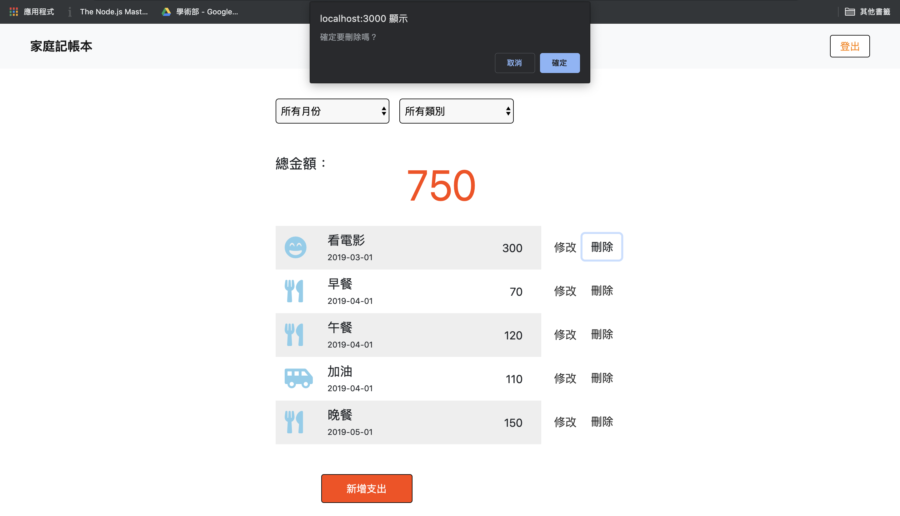

# 我的餐廳清單
簡易的家庭記帳本網頁程式，使用者可操作基礎的CRUD（新增 / 讀取 / 更新 / 刪除）功能

## Features 
- 可新增、讀取、更新、刪除你的所有支出
- 可針對支出的月份以及支出的種類進行篩選(Filter)
- 可使用本地端登入也可以使用 Facebook 第三方登入
- 登入及註冊時設有防呆機制
- 刪除前會提醒使用者是否要刪除以免誤按

## Screenshots
- 註冊

註冊時若格式不符則會在該欄位亮起警示及提示訊息，並且不予其送出表單。

若該 email 已經被註冊，則會向使用者發送錯誤訊息，並導回註冊頁面。

- 登入

登入時若格式不符則會在該欄位亮起警示及提示訊息，並且不予其送出表單。

若該 email 尚未註冊或是輸入密碼錯誤，則會向使用者發送錯誤訊息，並導回登入頁面。

- 首頁

- 新增頁面

- 編輯頁面

- 篩選功能

- 刪除前出現確認刪除對話框

